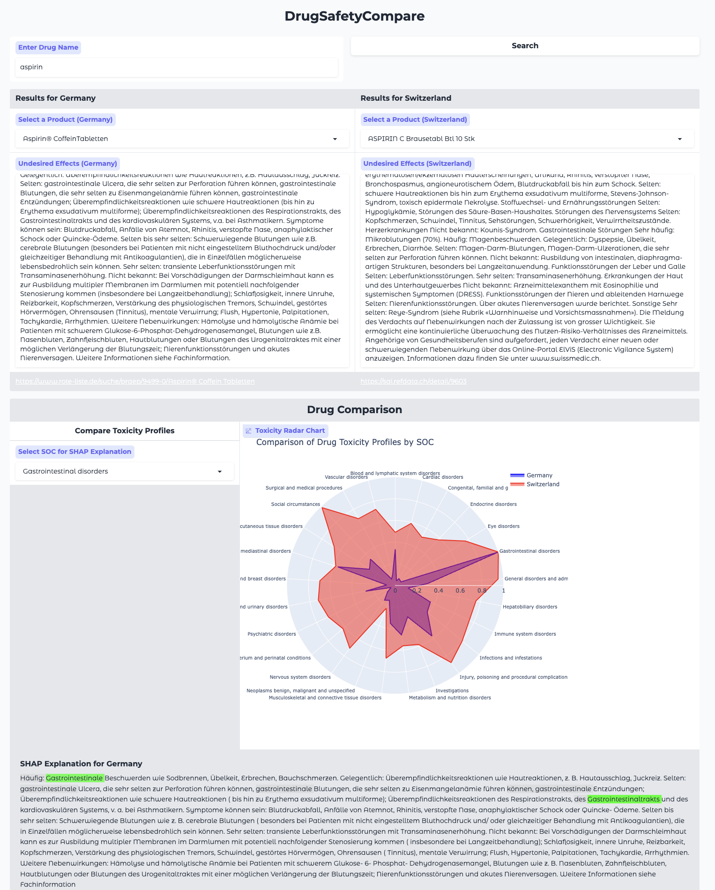
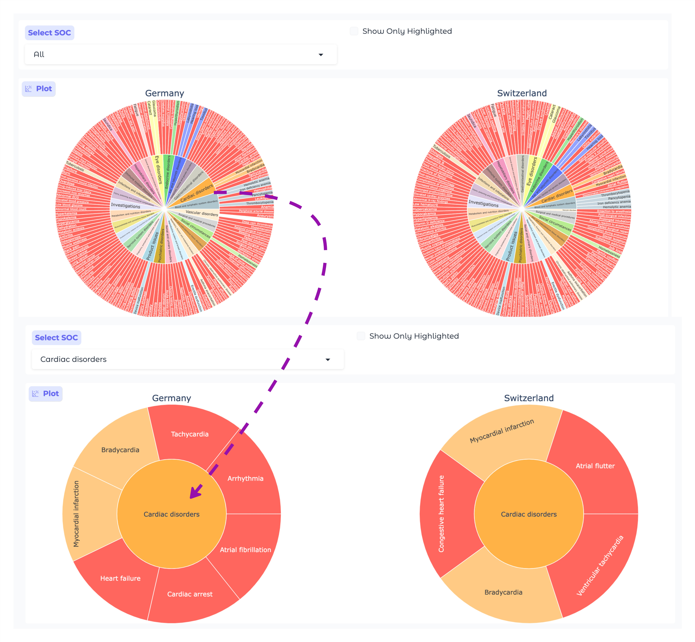

# Welcome to DrugSafetyCompare!

**DrugSafetyCompare** is a *Gradio-based* application designed to help  users to compare the safety profiles of drugs between Germany and Switzerland. By entering a drug name, the application retrieves drug labels from both countries, extracts safety-related information, and performs an analysis to compare the potential adverse effects across different system organ classes (SOCs) defined by MedDRA.

[Skip to Installation](#installation-guide){: .btn .btn-purple }
[See in action](https://huggingface.co/spaces/vianu/drugsafetycompare){: .btn .btn-purple }

## Features

1. **Drug Search and Retrieval**: Start by entering a keyword to search for a drug. The application retrieves drug labels and safety information from both Germany and Switzerland.

2. **Safety Information Extraction**:
   - **Transformer Pipeline**: Uses a zero-shot classification model (`facebook/bart-large-mnli`) to predict the relevance and potential impact of the safety information on each of MedDRA's 27 SOCs.
   - **GPT-4 Pipeline**: Utilizes OpenAI's GPT-4 model to infer all mentioned adverse events (AEs) from the safety information, then uses the zero-shot classification model to predict which SOCs are most impacted by each AE.

3. **Toxicity Profile Comparison**:
   - **Radar Chart Visualization**: The toxicity profiles of the drugs are compared visually using radar (spider) charts, where each axis represents a specific SOC. The overlaid profiles highlight differences between the drugs from the two countries.
   - **SHAP Explanations** (Transformer Pipeline): For each SOC, a SHAP plot can be generated to identify the textual features contributing most to the predictions, providing detailed insights into the factors driving the classification.
   - **Sunburst Chart Visualization** (GPT-4 Pipeline): An interactive sunburst chart allows users to explore all SOCs and their corresponding AEs, highlighting differences between the countries.

## How It Works

1. **Search for a Drug**: Enter the name of the drug you are interested in. The application searches for products in both Germany and Switzerland and displays the results.

2. **Select Products**: Choose specific products from each country to compare their safety information.

3. **Select Analysis Pipeline**:
   - **Transformer Pipeline**:
     - Extracts safety information from the drug labels.
     - Uses the zero-shot classification model to predict the impact on each SOC.
     - Visualizes the results using a radar chart.
     - Provides SHAP explanations for in-depth analysis.
   - **GPT-4 Pipeline**:
     - Extracts safety information and uses GPT-4 to infer all mentioned AEs.
     - Uses the zero-shot classification model to predict the impact on each SOC for each AE.
     - Visualizes the results using a radar chart.
     - Provides an interactive sunburst chart to explore SOCs and their corresponding AEs.

4. **Compare Toxicity Profiles**: Generate visualizations to compare the toxicity profiles of the selected products from Germany and Switzerland.

### Transformer Pipeline



### GPT-4 Pipeline



## Getting Started

### Prerequisites

- Python 3.11 or higher
- Required Python packages (see `requirements.txt`)
- OpenAI API key (for GPT-4 Pipeline)


## Usage

1. **Enter Drug Name**: Input the name of the drug you want to compare.

2. **Search**: Click on the **Search** button to retrieve products from Germany and Switzerland.

3. **Select Products**: From the dropdown menus, select the specific products you want to analyze.

4. **Select Analysis Pipeline**: Choose between the **Transformer Pipeline** and the **GPT-4 Pipeline**.

5. **Provide OpenAI API Key** (if using GPT-4 Pipeline): Enter your OpenAI API key when prompted.

6. **Compare Toxicity Profiles**: Click on the **Compare Toxicity Profiles** button to generate the visualizations.

7. **Explore Results**:
   - **Radar Charts**: Use the radar charts to compare the overall toxicity profiles across SOCs.
   - **SHAP Explanations** (Transformer Pipeline): Select an SOC from the dropdown to view SHAP explanations highlighting the textual features influencing the predictions.
   - **Sunburst Charts** (GPT-4 Pipeline): Interact with the sunburst chart to explore SOCs and their corresponding AEs, and identify unique adverse events in each country.


## Prerequisites

Before you begin, ensure you have the following installed:

- **Python 3.10 or higher**: [Download Python](https://www.python.org/downloads/)
- **OpenAI API Key**: Obtain your API key from [OpenAI](https://platform.openai.com/account/api-keys)

## Installation Guide

1. **Download package**

   ```bash
   pip install vianu
   ```
2. **Launch app** (with starterscript)
    ```bash
    vianu_drugsafetycompare_app
    ```
    The application will launch and can be accessed via your web browser at `http://127.0.0.1:7860/?__theme=light`.
3. **Use Pipeline to Extract Drug Labels**: In Python you can use the following:
    ```python
        from vianu.drugsafetycompare.src.germany import GermanDrugInfoExtractor
        extractor = GermanDrugInfoExtractor()
        try:
            # Define the drug name
            drug_name = "aspirin"
            # Search for products matching the drug name
            products = extractor.search_drug(drug_name)
            # Select the third product (index 2)
            selected_product = products[2]
            # Get the product URL
            product_url = selected_product["link"]
            # Retrieve undesired effects
            side_effects = extractor.get_undesired_effects(product_url)
            # Print the results
            print(f"Selected Product: {selected_product['name']}\n")
            print("Undesired Effects:")
            print(side_effects)

        finally:
            # Close the extractor
            extractor.quit()

    ```

