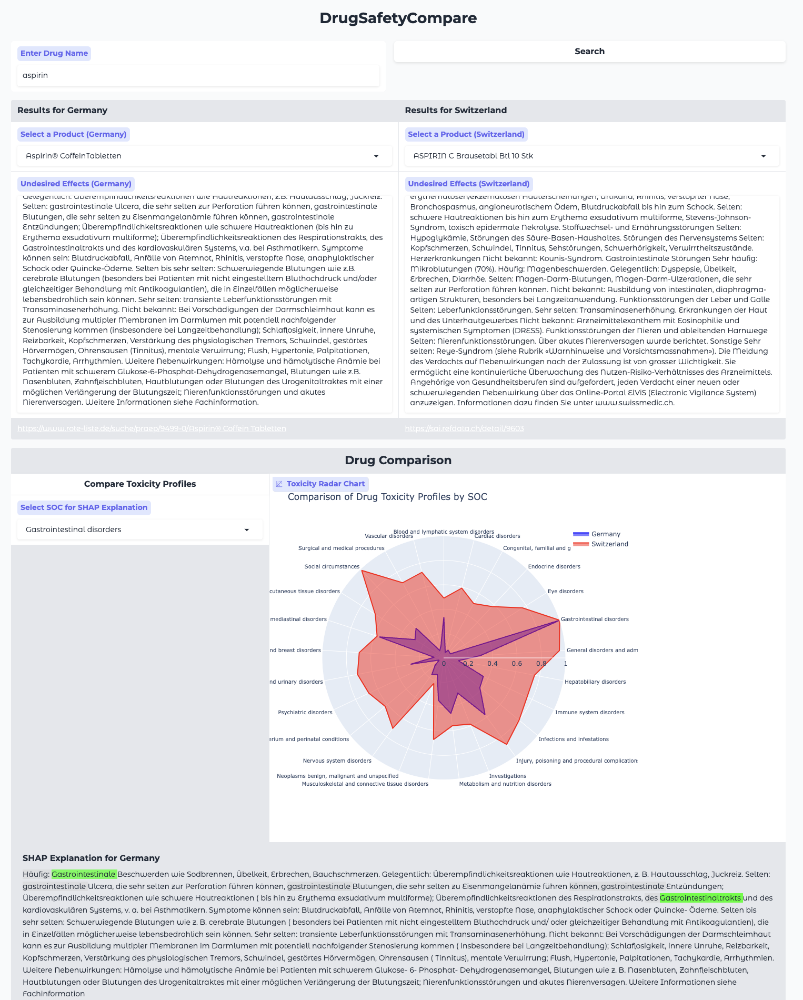
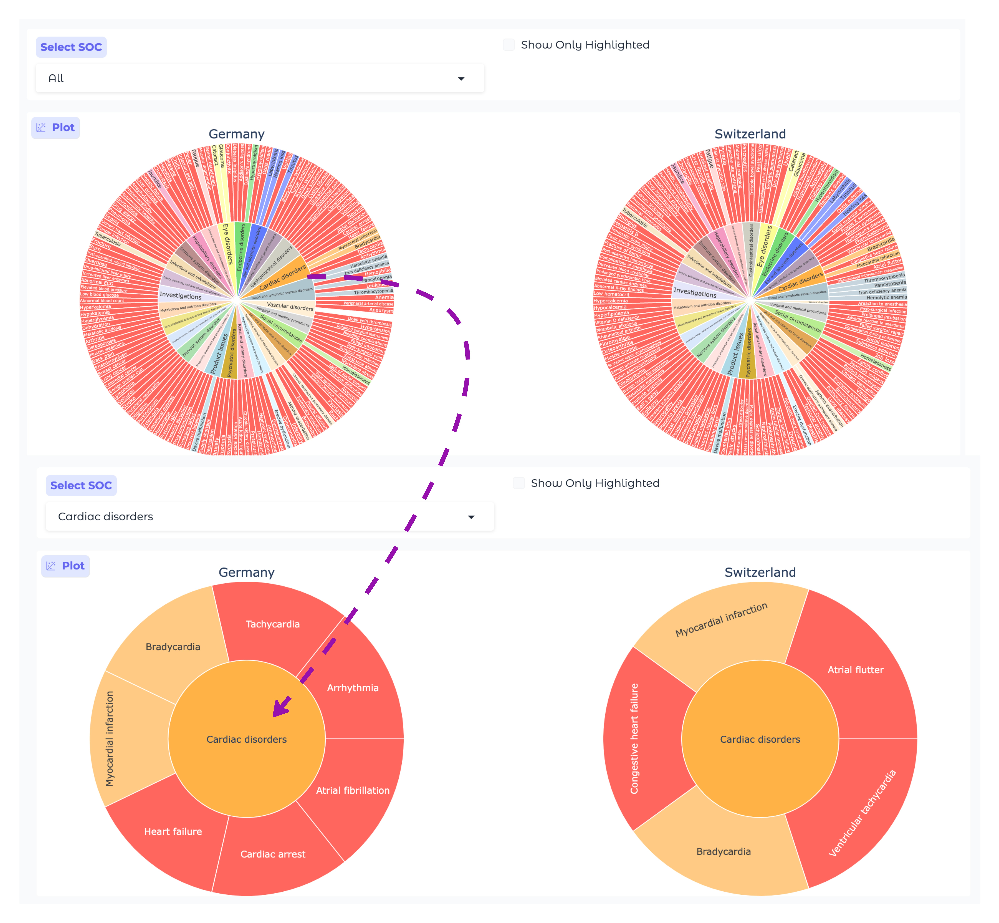

# Welcome to DrugSafetyCompare!

**DrugSafetyCompare** is a *Gradio-based* application designed to help users search for drugs, retrieve product information from Germany and Switzerland, extract adverse events, and compare side effects using SOC (System Organ Class) classification. Leveraging OpenAI's GPT-4 and interactive visualization tools, DrugSafetyCompare provides a comprehensive overview of drug safety profiles.

[Skip to Installation](#installation-guide){: .btn .btn-purple }


## Available Features

- **Drug Search**: Search for a drug and retrieve its products from Germany and Switzerland.
- **Side Effects Retrieval**: Select specific products to view their side effects.
- **Adverse Event Extraction**: Extract adverse events from side effects using OpenAI's GPT-4.
- **SOC Classification & Visualization**: Compare side effects using SOC classification and visualize them with radar charts and sunburst plots.


## How it works
There are currently two applications implemented:


**Application 1** starts with a keyword search, retrieving drug labels from Switzerland and Germany and extracting safety-related information. This information is encoded and processed using a zero-shot classification model (transformers `zero-shot-classification` pipeline with `facebook/bart-large-mnli` model) to predict its relevance and potential impact on each of MedDRAs 27 system organ classes (SOCs), determining harmful effects. The toxicity profiles of the drugs are then compared visually using a spider chart, where each spike represents a specific SOC, and the overlaid profiles highlight differences across the two drugs. Finally, for each SOC, a SHAP plot can be generated to identify the textual features contributing most to the prediction, providing detailed insights into the factors driving the classification.


**Application 2** is similar as pipeline 1, however, it uses OpenAI's GPT-4o model to infer all mentioned adverse events (AE) from the safety information. Then, we are using a zero-shot classification model (transformers `zero-shot-classification` pipeline with `facebook/bart-large-mnli` model) to predict for each AE which SOCs they would be impacting most. The results are again ploted on a spider chart. Lastely we are using an interactive sunburst chart that allows to see all SOCs and the corresponding AEs.



# Installation Guide

This section provides instructions to install and set up **DrugSafetyCompare** on your local machine.

## Prerequisites

Before you begin, ensure you have the following installed:

- **Python 3.10 or higher**: [Download Python](https://www.python.org/downloads/)
- **OpenAI API Key**: Obtain your API key from [OpenAI](https://platform.openai.com/account/api-keys)

## Installation Steps

1. **Download pacakage**

   ```bash
   pip install vianu
   ```
2. **Launch app** (with starterscript)
    ```bash
    vianu_drugsafetycompare_app
    ```
3. **Use Pipeline to Extract Drug Labels**: In Python you can use the following:
    ```python
        from vianu.drugsafetycompare.src.germany import GermanDrugInfoExtractor
        extractor = GermanDrugInfoExtractor()
        try:
            # Define the drug name
            drug_name = "aspirin"
            # Search for products matching the drug name
            products = extractor.search_drug(drug_name)
            # Select the third product (index 2)
            selected_product = products[2]
            # Get the product URL
            product_url = selected_product["link"]
            # Retrieve undesired effects
            side_effects = extractor.get_undesired_effects(product_url)
            # Print the results
            print(f"Selected Product: {selected_product['name']}\n")
            print("Undesired Effects:")
            print(side_effects)

        finally:
            # Close the extractor
            extractor.quit()

    ```